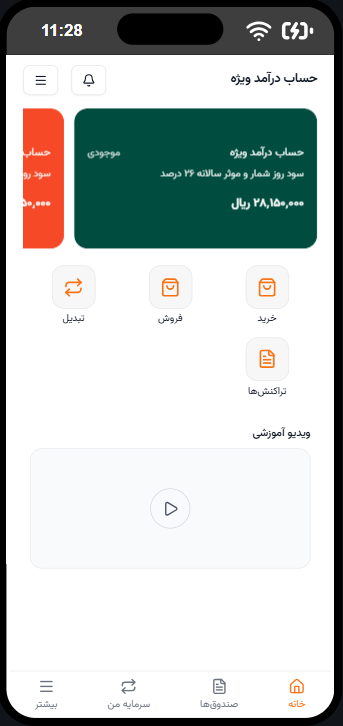

# Karamad - Modern Web Application



## 🌟 Overview

Karamad is a modern web application built with Next.js 16, React 19, and TypeScript, designed to
provide a seamless user experience with advanced features and beautiful animations.

## ✨ Features

- **Modern UI Components**
  - Custom Button Components
  - Responsive Card System
  - Interactive Card Carousel
  - Animated Video Sections
  - Bottom Navigation
  - Header Components

- **Advanced Technologies**
  - Built with Next.js 16 for optimal performance
  - TypeScript for type safety
  - Tailwind CSS for styling
  - AOS (Animate On Scroll) for smooth animations
  - Embla Carousel for smooth slider experiences
  - Lottie animations for engaging user interactions

- **Performance Optimized**
  - Server-side rendering capabilities
  - Optimized image loading
  - Custom font implementation (Vazirmatn)
  - Responsive design for all devices

## 🚀 Getting Started

### Prerequisites

- Node.js (Latest LTS version recommended)
- PNPM package manager

### Installation

1. Clone the repository

```bash
git clone https://github.com/your-username/karamad.git
```

2. Navigate to project directory

```bash
cd karamad
```

3. Install dependencies

```bash
pnpm install
```

4. Run development server

```bash
pnpm dev
```

5. Open [http://localhost:3000](http://localhost:3000) in your browser

## 🛠️ Available Scripts

- `pnpm dev` - Runs the development server
- `pnpm build` - Creates an optimized production build
- `pnpm start` - Starts the production server
- `pnpm lint` - Runs ESLint for code linting
- `pnpm lint:fix` - Fixes ESLint issues automatically
- `pnpm format` - Formats code using Prettier

## 📁 Project Structure

```
karamad/
├── app/                   # Next.js app directory
│   ├── fonts/            # Custom font configurations
│   ├── funds/            # Funds related pages
│   ├── myCapital/        # Capital management pages
│   └── more/             # Additional features
├── components/           # React components
│   ├── ui/              # UI components
│   └── ...              # Other components
├── data/                # Static data files
├── hooks/               # Custom React hooks
├── lib/                 # Utility functions
├── public/             # Static assets
│   └── images/         # Image assets
└── utils/              # Helper functions
```

## 🎨 Tech Stack

- **Framework:** Next.js 16.0.0
- **UI Library:** React 19.2.0
- **Styling:** Tailwind CSS
- **Animation Libraries:**
  - AOS (Animate on Scroll)
  - Lottie Animations
- **Carousel:** Embla Carousel
- **Development Tools:**
  - TypeScript
  - ESLint
  - Prettier

## 🔧 Configuration

The project includes several configuration files:

- `next.config.ts` - Next.js configuration
- `tsconfig.json` - TypeScript configuration
- `tailwind.config.js` - Tailwind CSS configuration
- `postcss.config.mjs` - PostCSS configuration
- `eslint.config.mjs` - ESLint configuration

## 📱 Responsive Design

The application is fully responsive and works seamlessly across:

- Desktop devices
- Tablets
- Mobile devices

## 🤝 Contributing

1. Fork the repository
2. Create your feature branch: `git checkout -b feature/amazing-feature`
3. Commit your changes: `git commit -m 'Add some amazing feature'`
4. Push to the branch: `git push origin feature/amazing-feature`
5. Open a Pull Request

## 📄 License

This project is licensed under the MIT License - see the LICENSE file for details.

## 📞 Contact

For any inquiries or issues, please open an issue in the GitHub repository.

---

Built with ❤️ using Next.js and React
